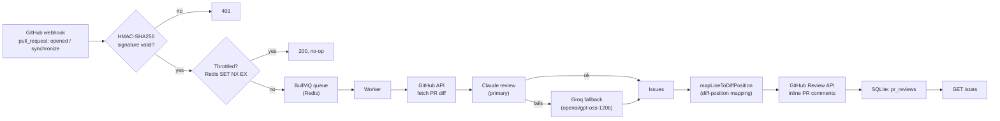
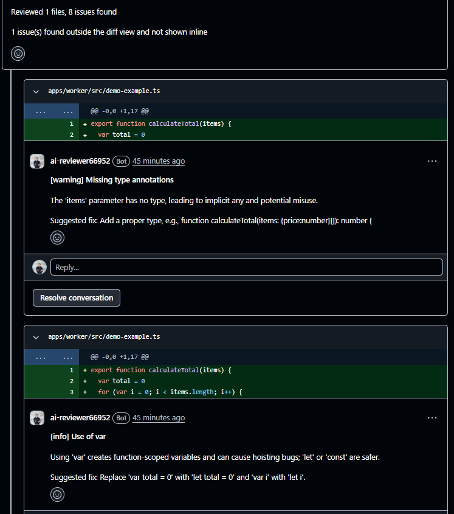
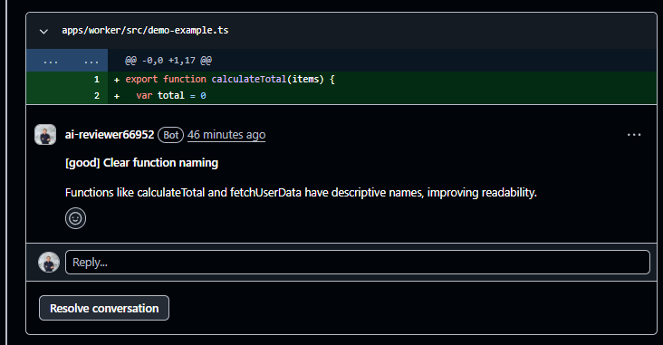

# ai-review-bot

## What it is

A GitHub App that reviews pull requests with an LLM and posts real inline
comments on the diff — not a demo form pasted over an LLM API. It listens
to GitHub webhooks, queues the review, fetches the PR diff through the
GitHub API, runs it through Claude (falling back to Groq on failure), maps
findings back to exact diff positions, and posts them as a GitHub PR
review. Every run is logged to SQLite and exposed through a `/stats`
endpoint.

## Why this isn't just ai-reviewer v2

[ai-reviewer](https://github.com/vlad-vsdc/ai-reviewer) was a single-page app: paste a
code snippet into a form, get a review back, no persistence, no GitHub
integration. This project reuses its prompt but throws away everything
else about the shape of the system. `ai-review-bot` is an unattended
service — a GitHub App that reacts to real `pull_request` webhook events,
queues work instead of blocking the HTTP request, isolates per-file
failures so one bad file doesn't sink the whole PR, rate-limits itself
against the same PR, and survives an LLM provider outage by falling back
to a second one. Nobody pastes anything into anything.

## Architecture



Two long-running processes share one `packages/core`:

- **`apps/webhook`** (Fastify) — verifies the webhook signature, filters
  events, throttles, enqueues the job. Nothing else. It never talks to an
  LLM.
- **`apps/worker`** (BullMQ worker) — fetches the diff, runs the review
  pipeline, posts comments, records the outcome.

## Stack

TypeScript · Node.js · Fastify · BullMQ · Redis · better-sqlite3 ·
Claude API (`claude-sonnet-5`) · Groq API (`openai/gpt-oss-120b`, fallback)

## Engineering decisions worth highlighting

- **Two-provider fallback with honest error isolation.** Claude is
  primary; any failure (auth, rate limit, timeout) falls back to Groq for
  that file. Files are reviewed concurrently (`p-limit(3)`) via
  `Promise.allSettled`, not `Promise.all` — one file rejecting doesn't
  throw away the issues already found in the other files, and doesn't
  fail the whole PR. The failed file is recorded in `skippedFiles` instead
  and the job keeps going.
- **Diff-position mapping, not text matching.** GitHub's Review API takes
  a `position` computed against the unified diff, not a file line number.
  `mapLineToDiffPosition` walks the patch's hunks (`@@ -a,b +c,d @@`),
  tracks the new-file line counter, and returns the diff position for a
  given source line — or `null` if the line isn't part of the diff, in
  which case the issue is reported in the review summary instead of
  silently dropped.
- **Hard limits and throttling as cost control.** `MAX_DIFF_LINES_PER_FILE`
  (default 800) skips oversized files before they ever reach an LLM call.
  A Redis `SET NX EX` keyed on `repo:pr` throttles repeat webhook deliveries
  for the same PR (default 5 minutes) so a burst of `synchronize` events
  doesn't queue a review per push.
- **Every run logged, provider and cost included.** `pr_reviews` records
  status (`success` / `partial` / `failed`), which provider actually
  served the review (`claude` / `groq` / `mixed`, if a PR mixed both across
  its files), token usage, duration, and error message on failure.
  `GET /stats` aggregates it — not a demo metric, an endpoint backed by a
  real table.

## Live proof

Real PR in this repository reviewed and commented on by the bot:

- **[PR #4](https://github.com/vlad-vsdc/ai-review-bot/pull/4)** — 27
  issues found across 6 files, **24 posted as inline comments**, 3
  reported in the summary as outside the diff view, 2 files skipped after
  Groq hit a rate limit. Claude failed auth on this run (empty key at the
  time) and every file fell back to Groq — a real fallback path exercised
  live, not simulated in a test.

The bot reviewing its own repository — real inline comments on a real PR
([#6](https://github.com/vlad-vsdc/ai-review-bot/pull/6)):



Beyond flagging issues, the bot also acknowledges good patterns —
not just a linter with opinions:



Actual response from `GET /stats` on the running instance:

```json
{
  "totalReviews": 1,
  "byStatus": { "success": 0, "failed": 0, "partial": 1 },
  "byProvider": { "claude": 0, "groq": 1, "mixed": 0 },
  "totalIssuesFound": 4,
  "totalPostedComments": 0,
  "totalUnmappableIssues": 4,
  "totalInputTokens": 328,
  "totalOutputTokens": 823,
  "avgDurationMs": 3534,
  "recentReviews": [
    {
      "repoFullName": "vlad-vsdc/ai-review-bot",
      "prNumber": 5,
      "status": "partial",
      "providerUsed": "groq",
      "issuesFound": 4,
      "postedComments": 0,
      "createdAt": "2026-09-16 14:21:28"
    }
  ]
}
```

(This is the row for PR #5, logged after the `pr_reviews` table shipped.
PR #4 predates that table, which is why its 24 posted comments don't show
up here — the numbers above are what `/stats` actually returns today, not
retrofitted.)

## Running locally

1. Register a GitHub App (Settings → Developer settings → GitHub Apps)
   with `pull_request` webhook subscription and `Pull requests: write`
   permission (to post reviews). Note the App ID, generate a private key,
   and set a webhook secret.
2. Copy `.env.example` to `.env` and fill in `GITHUB_APP_ID`,
   `GITHUB_PRIVATE_KEY_PATH`, `WEBHOOK_SECRET`, `REDIS_URL`,
   `CLAUDE_API_KEY`, `GROQ_API_KEY`.
3. `npm install`
4. Run the two processes separately:
   ```bash
   npm run dev --workspace=apps/webhook
   npm run dev --workspace=apps/worker
   ```
5. Point the GitHub App's webhook at your webhook process (a tunnel like
   `smee` or `ngrok` works for local development) and open a PR.

## What's deliberately not in the MVP

- No auto-fixing — the bot comments, it doesn't push fixes.
- No languages beyond TS/JS/Python (`.ts`, `.tsx`, `.js`, `.jsx`, `.py`) —
  that's what the diff filter accepts.
- No self-serve public install — this runs against one GitHub App
  installation the author controls, not a marketplace listing.
- No retry/backoff on the BullMQ queue — a failed job fails; per-file
  errors are isolated (see above), but the queue itself has no retry
  policy configured.
- No auth on `/stats` — it's a demo observability endpoint, not a
  production admin API.
